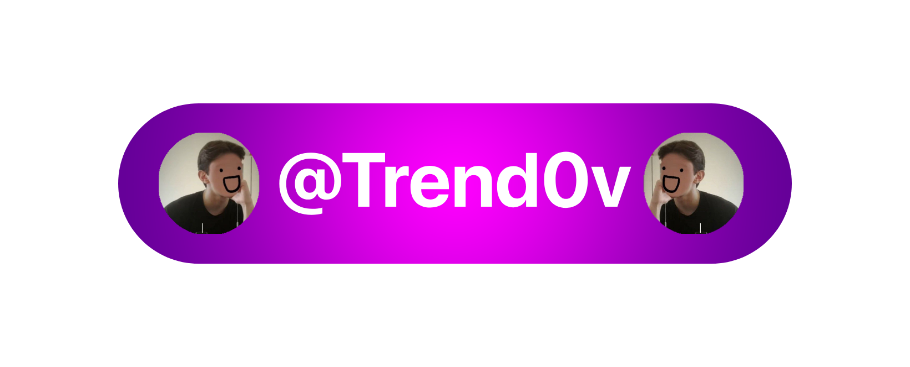

  <!-- Ваш кастомный баннер (загрузите его в свой репозиторий Trendov/Trendov в папку assets) -->
  

<h2 align="center">👋 Привет, я Трендов — разработчик из Казахстана 🇰🇿</h2>

  
  
  
  
  

---

### 🚀 Обо мне
* 💻 Начал кодить в **2023 году**.
* 🛠️ Пишу код для самых разных задач: от плагинов для Minecraft и модификаций для игр до Telegram-ботов.
* 🔍 Увлекаюсь **OSINT разведкой** и поиском информации.

---

### 💬 Связь & Правила общения

* ✈️ **Мой Telegram:** [@Trend0vv](https://t.me/Trend0vv)

> [!IMPORTANT]
> ### 🛑 Пожалуйста, будьте вежливыми!
> 🔗 Я поддерживаю культуру **[непривет.рф](https://непривет.рф/)**
> **Не пишите мне просто «Привет» или «Как дела?».** Сразу пишите свой конкретный вопрос или предложение, и я обязательно отвечу вам в течение ближайших 24 часов! ⏱️

---

  <i>«Код — это музыка мысли, а программист — её исполнитель» Trendov</i>

